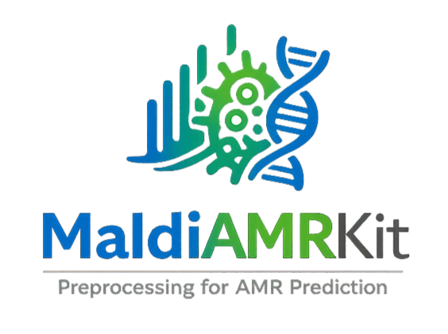
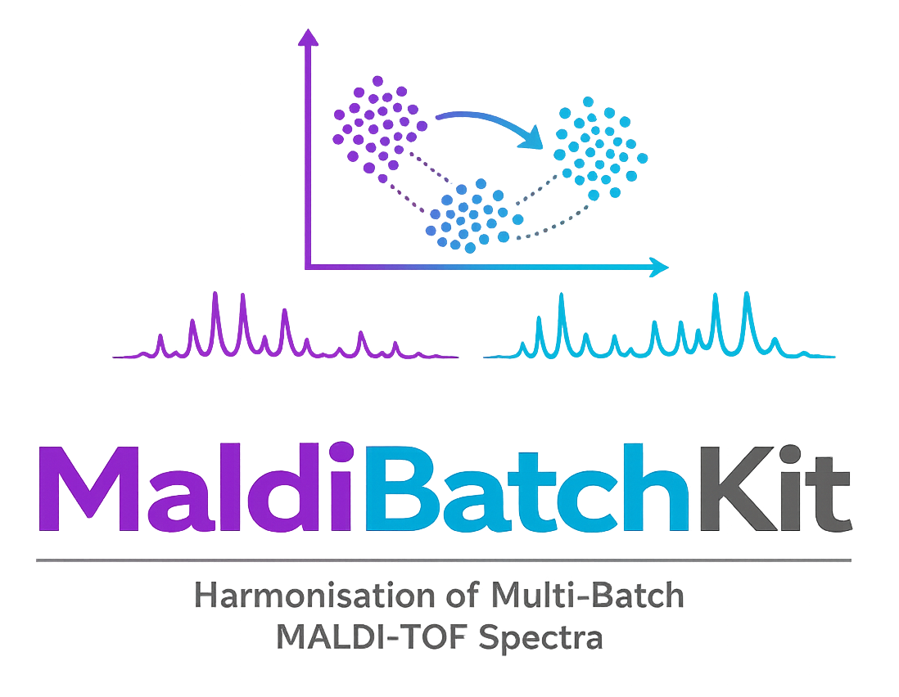
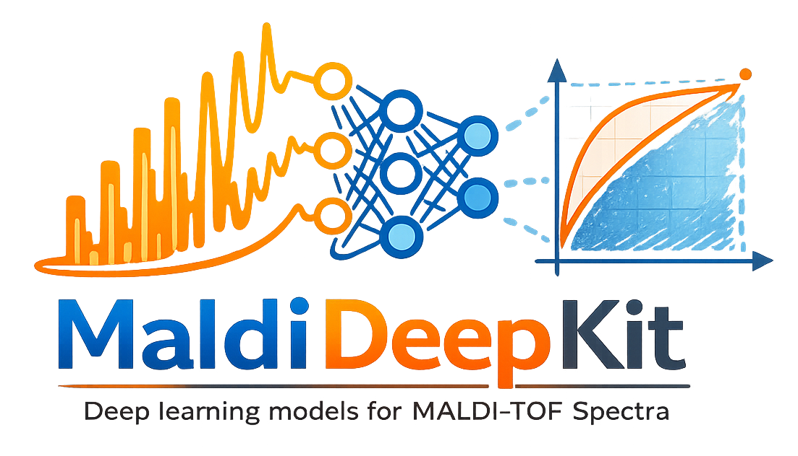

# MaldiSuite

[](https://ettorerocchi.github.io/MaldiSuite/)
[](https://pypi.org/project/maldisuite/)
[](https://www.python.org/)
[](LICENSE)

**MaldiSuite** is a Python ecosystem for MALDI-TOF spectral processing and analysis in antimicrobial resistance research. It combines preprocessing, batch effect correction,
and deep learning classifiers in a single sklearn-compatible workflow for clinical
microbiology and computational biology research.

> **Landing page:** [MaldiSuite](<https://ettorerocchi.github.io/MaldiSuite/>)

---

## What this repository contains

This repository serves two purposes:

1. **Landing page** for the website.
2. **Meta-package**: a minimal PyPI package (`maldisuite`) that installs the three
   packages of the suite with pinned compatible versions.

This repository **does not** contain the source code of the three packages.
Each package lives in its own repository, with its own issues, documentation,
and release cycle.

## The three packages

MaldiAMRKit owns the data model, preprocessing, evaluation, and biomarker / drift modules; MaldiBatchKit re-exports every corrector (ComBat variants, Limma, Harmony, MALDI-specific harmonisers) at the top level; MaldiDeepKit ships scikit-learn-compatible deep classifiers (`MaldiMLPClassifier`, `MaldiCNNClassifier`, `MaldiResNetClassifier`, `MaldiTransformerClassifier`).

| Logo | Package | Purpose | Repository |
|:---:|---|---|---|
|  | **MaldiAMRKit** | Preprocessing, evaluation, biomarkers, drift monitoring | [MaldiAMRKit](https://github.com/EttoreRocchi/MaldiAMRKit) |
|  | **MaldiBatchKit** | Batch effect correction for mass spectra | [MaldiBatchKit](https://github.com/EttoreRocchi/MaldiBatchKit) |
|  | **MaldiDeepKit** | Deep learning classifiers for MALDI-TOF spectra | [MaldiDeepKit](https://github.com/EttoreRocchi/MaldiDeepKit) |

## Installation

Install the full suite with a single command:

```bash
pip install maldisuite
```

This installs `maldiamrkit`, `maldibatchkit`, and `maldideepkit` at compatible versions.

Alternatively, install individual packages separately:

```bash
pip install maldiamrkit     # preprocessing, biomarkers, drift
pip install maldibatchkit   # batch effect correction
pip install maldideepkit    # deep learning classifiers
```

## Quick start

```python
from maldiamrkit import MaldiSet
from maldiamrkit.evaluation import CaseGroupedKFold, vme_scorer
from maldibatchkit import BatchAwareWarping, ComBat
from maldideepkit import MaldiMLPClassifier
from sklearn.pipeline import Pipeline
from sklearn.model_selection import cross_val_score

data = MaldiSet.from_directory("driams/", "meta.csv", bin_width=3)
batch = data.meta["batch"]

pipe = Pipeline([
    ("warp",   BatchAwareWarping(batch=batch)),
    ("combat", ComBat(batch=batch, method="fortin")),
    ("clf",    MaldiMLPClassifier(input_dim=data.X.shape[1], random_state=0)),
])

scores = cross_val_score(
    pipe, data.X, data.get_y_single("Drug"),
    scoring=vme_scorer,
    cv=CaseGroupedKFold(n_splits=5),
    groups=data.meta["patient_id"],
)
```

## Citation

Citation will be available soon.

## License

MIT License - see [`LICENSE`](LICENSE) for the full text.

## Acknowledgments

MaldiSuite builds on the work of the mass spectrometry and clinical microbiology communities. In particular, we acknowledge:

- MALDIquant (Gibb & Strimmer, 2012, *Bioinformatics*)
- The Borgwardt Lab and the DRIAMS benchmark (Weis et al., 2022, *Nature Medicine*), which established Python-based MALDI-TOF AMR prediction as a research area